# Portfolio App - Dron TV Assessment

A modern portfolio application built with cutting-edge technologies that allows users to create, edit, and showcase their professional profiles with multiple template options.

## 🛠️ Built With

<div align="center">


*Frontend Framework - Responsive and dynamic user interface*


*Runtime Environment - Server-side JavaScript execution*


*Web Framework - Robust backend API development*


*Database - Relational database management*


*CSS Framework - Modern and responsive design*

</div>

## 📥 Installation Steps

Follow these steps to set up the project locally:

### Prerequisites
- **Node.js** (v14 or higher)
- **npm** (Node Package Manager)
- **MySQL** Server

### Installation Guide
1. **Install Node.js and npm**
   ```bash
   # Download and install from https://nodejs.org/
   node --version
   npm --version
   ```

2.**Clone the Project**
```bash
   git clone https://github.com/Sohailshaikh5656/PortfolioPro.git
   cd portfolio-app
```
3.**Database Setup**
Setup Database the Sql is in Backend folder Check All Creaderntails should be correct ! Database Name, UserName, Password, Port

4.**Configure Database Credentials**
```bash
   # Edit backend/config/database.js
   # Update with your MySQL credentials:
   # host, user, password, database name
```
4.**Backend Setup**
```bash
   # In backend directory
      npm install
      nodemon start
   # Server will run on http://localhost:3300
```
4.**Frontend Setup**
```bash
   # Open new terminal, navigate to frontend
      cd ../frontend
      npm install
      npm start
   # App will run on http://localhost:3000
```
📁 Project Structure

portfolio-app/
├── 📂 backend/
│   ├── 📂 config/
│   │   └── database.js
│   ├── 📂 controllers/
│   ├── 📂 models/
│   ├── 📂 routes/
│   ├── 📂 database/
│   │   └── database.sql
│   ├── package.json
│   └── server.js
├── 📂 frontend/
│   ├── 📂 public/
│   ├── 📂 src/
│   │   ├── 📂 components/
│   │   ├── 📂 pages/
│   │   ├── 📂 styles/
│   │   └── App.js
│   ├── package.json
│   └── README.md
└── README.md


✨ **Features**
   🚀 Fast API Calling
      Optimized RESTful APIs with Express.js
      Efficient database queries for quick response times
      Asynchronous operations for better performance

   👤 User Profile Creation
      Create comprehensive professional portfolios
      Upload profile pictures and cover images
      Add educational background and work experience
      Include skills, projects, and contact information

   ✏️ Edit Profile
      Real-time profile editing capabilities
      Drag-and-drop interface for easy customizatio
      Preview changes before saving
      Auto-save functionality

   🔍 Profile Discovery
      Browse all user profiles
      Advanced search and filtering option
      Category-based profile exploration
      Recommendation system

   🔎 Enhanced Search
      Smart search with auto-suggestions
      Filter by skills, location, experience
      Keyword-based profile matching
      Fast and accurate results

📸 **Project Demo**
<hr />
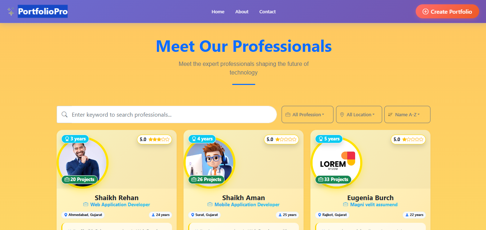
<br />
<hr />
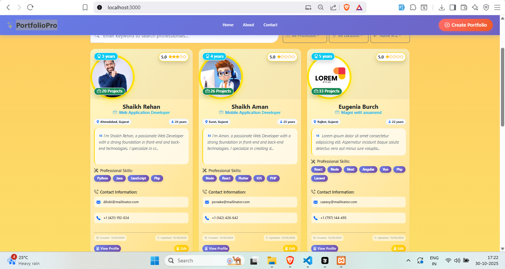
<br />
<hr />

<br />
<hr />
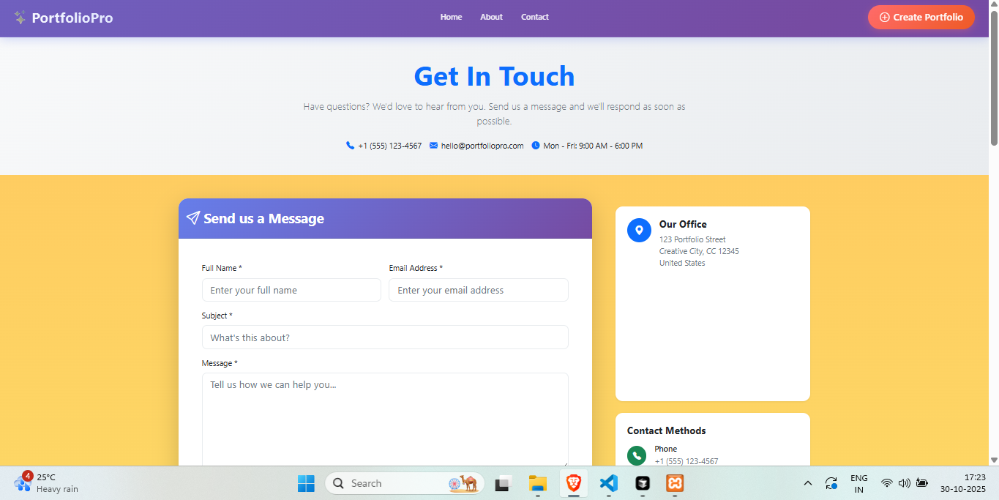
<br />
<hr />
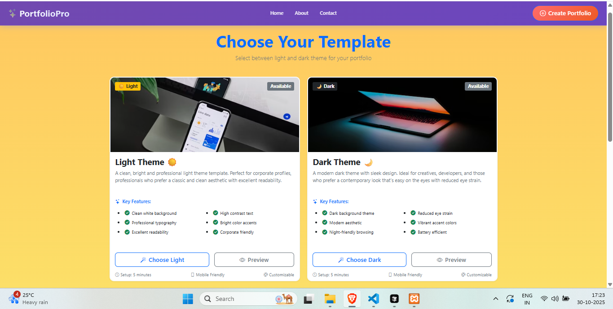
<br />
<hr />
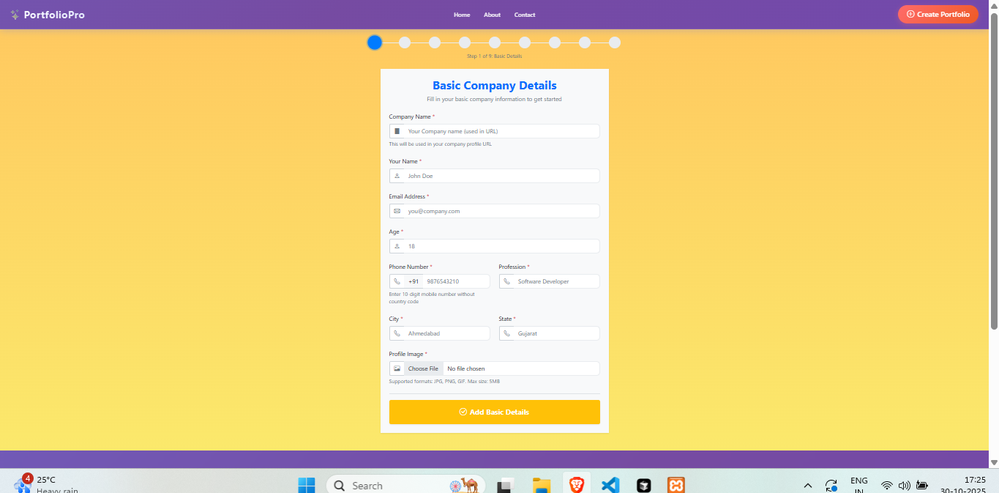
<br />
<hr />
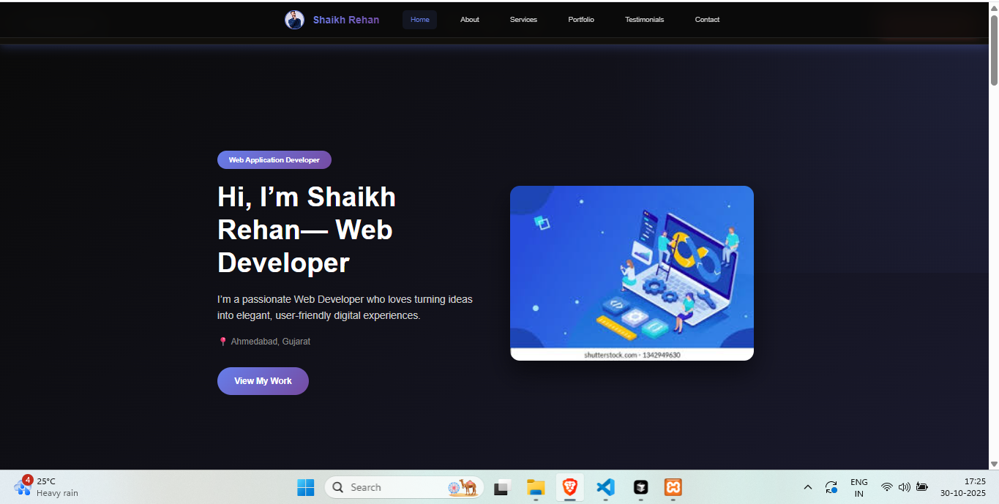
<br />
<hr />
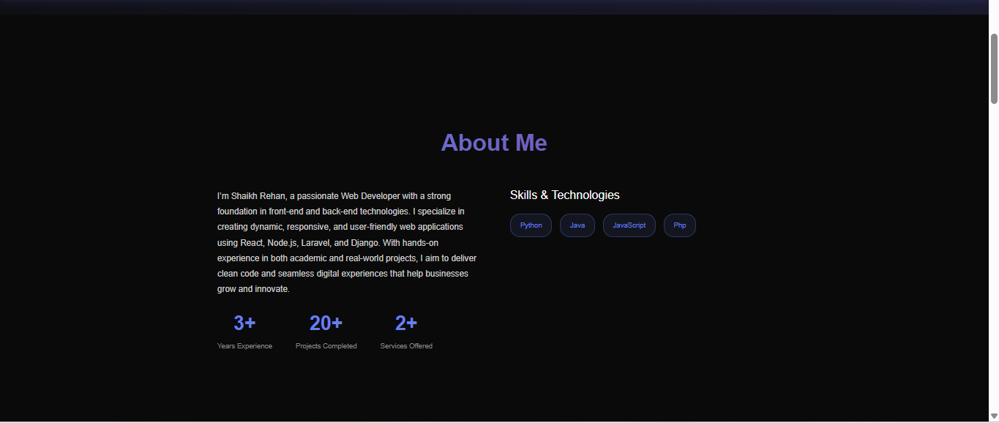
<br />
<hr />
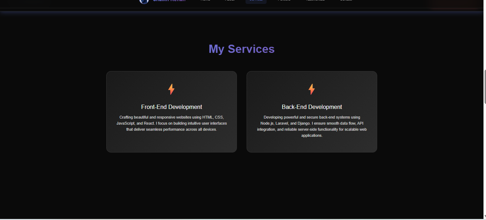
<br />
<hr />
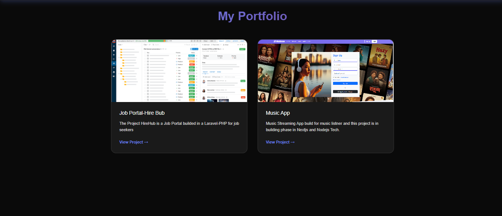
<br />
<hr />
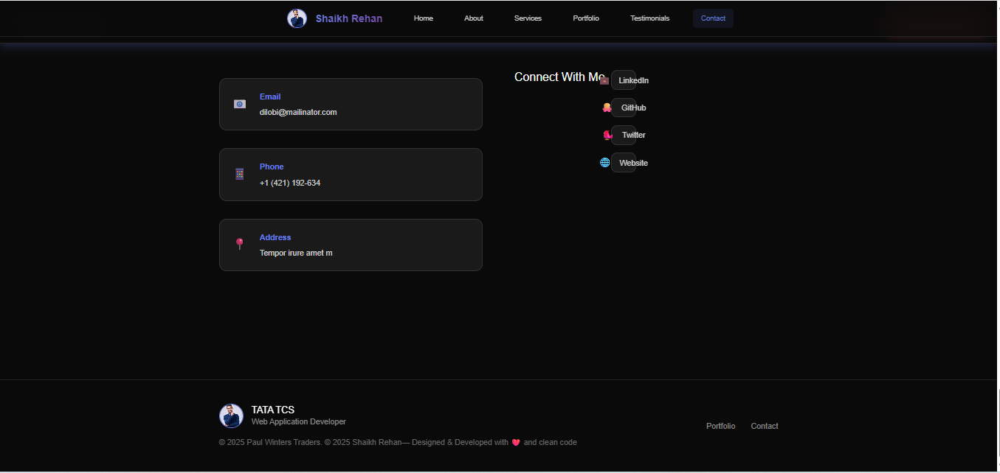
<br />
<hr />
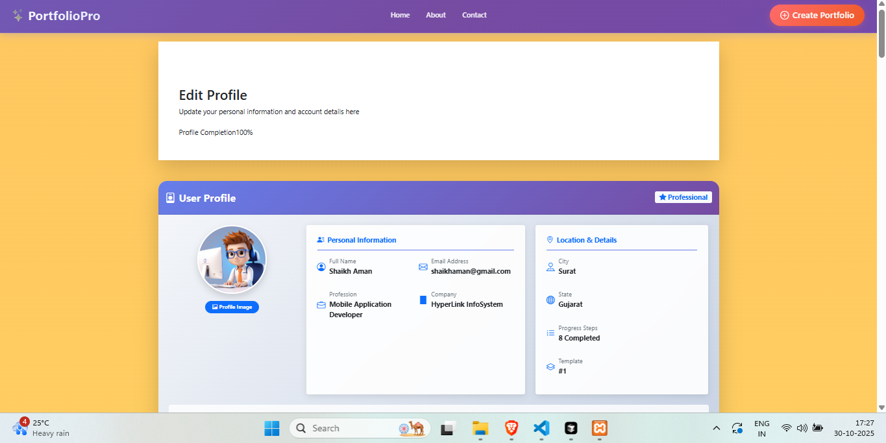
<br />
<hr />
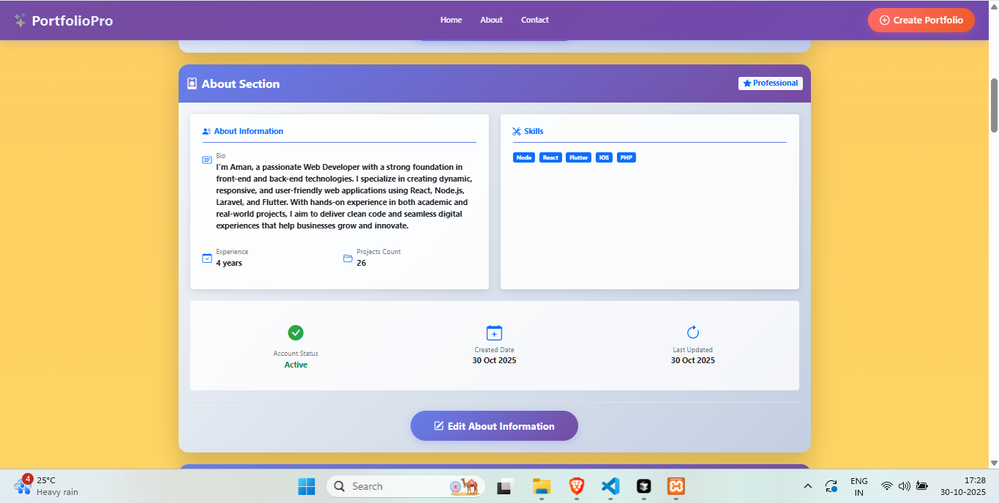
<br />
<hr />
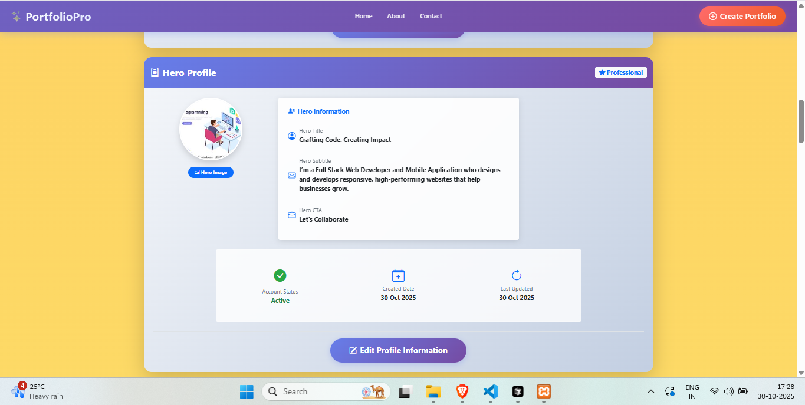
<br />
<hr />
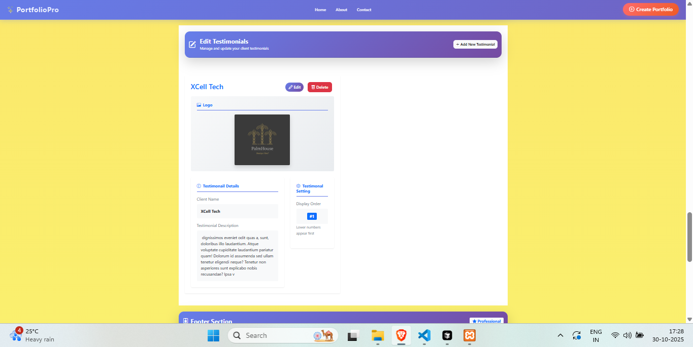
<br />


👨‍💻 **Author**
Shaikh Sohel

🎓 MCA @ LJ Campus
🎓 BCA @ Govt. K.K. Shastri College

💼 Technical Training in:

React.js
Node.js
Next.js
Mysql


