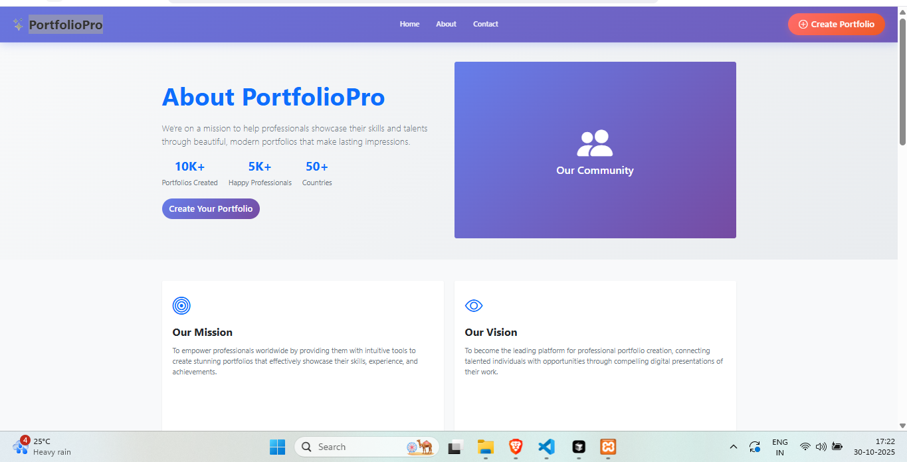

# Portfolio App - Dron TV Assessment

A modern portfolio application built with cutting-edge technologies that allows users to create, edit, and showcase their professional profiles with multiple template options.

## 🛠️ Built With

<div align="center" style="display: flex; justify-content: center; gap: 20px; flex-wrap: wrap; margin: 30px 0;">
  
  
  
  
  
</div>

This application utilizes a modern tech stack including React.js for the frontend, Node.js with Express.js for the backend server, MySQL for database management, and Bootstrap for responsive styling.

## 📥 Installation Steps

Follow these steps to set up the project locally:

### Prerequisites
- **Node.js** (v14 or higher)
- **npm** (Node Package Manager)
- **MySQL** Server

### Installation Guide

1. **Install Node.js and npm**
   ```bash
   # Download and install from https://nodejs.org/
   node --version
   npm --version
   ```

2. **Clone the Project**
   ```bash
     git clone https://github.com/Sohailshaikh5656/PortfolioPro.git
    cd portfolio-app
   ```

3. **Database Setup**
    Setup Database the SQL is in Backend folder Check All Credentials should be correct ! Database Name, UserName, Password, Port

4.**Configure Database Credentials**
```bash
    # Edit backend/config/database.js
    # Update with your MySQL credentials:
    # host, user, password, database name
```
5.**Backend Setup**
```bash
   # In backend directory
    npm install
    nodemon start
    # Server will run on http://localhost:3300
```

6.**Frontend Setup**
```bash
    # Open new terminal, navigate to frontend
    cd ../frontend
    npm install
    npm start
    # App will run on http://localhost:3000
```


📁 **Project Structure**
```bash
portfolio-app/
├── backend/
│   ├── config/
│   │   └── database.js
│   ├── controllers/
│   ├── models/
│   ├── routes/
│   ├── database/
│   │   └── database.sql
│   ├── package.json
│   └── server.js
├── frontend/
│   ├── public/
│   ├── src/
│   │   ├── components/
│   │   ├── pages/
│   │   ├── styles/
│   │   └── App.js
│   ├── package.json
│   └── README.md
└── README.md
```
<br />
✨ **Features**
<br />
<ul> <li><strong>🚀 Fast API Calling</strong> <ul> <li>Optimized RESTful APIs with Express.js</li> <li>Efficient database queries for quick response times</li> <li>Asynchronous operations for better performance</li> </ul> </li> <li><strong>👤 User Profile Creation</strong> <ul> <li>Create comprehensive professional portfolios</li> <li>Upload profile pictures and cover images</li> <li>Add background and work experience</li> <li>Include skills, projects, and contact information</li> </ul> </li> <li><strong>🎨 Multiple Templates</strong> <ul> <li>Various pre-designed portfolio templates</li> <li>Customizable layout options</li> <li>Responsive design for all devices</li> </ul> </li> <li><strong>✏️ Edit Profile</strong> <ul> <li>Real-time profile editing capabilities</li> <li>Drag-and-drop interface for easy customization</li> <li>Preview changes before saving</li> <li>Auto-save functionality</li> </ul> </li> <li><strong>🔍 Profile Discovery</strong> <ul> <li>Browse all user profiles</li> <li>Advanced search and filtering options</li> <li>Category-based profile exploration</li> <li>Recommendation system</li> </ul> </li> <li><strong>🔎 Enhanced Search</strong> <ul> <li>Smart search with auto-suggestions</li> <li>Filter by skills, location, experience</li> <li>Keyword-based profile matching</li> <li>Fast and accurate results</li> </ul> </li> </ul>

📸 **Project Demo**

<div align="center">
<hr />

<br />
<hr />

<br />
<hr />

<br />
<hr />

<br />
<hr />

<br />
<hr />

<br />
<hr />

<br />
<hr />

<br />
<hr />

<br />
<hr />

<br />
<hr />

<br />
<hr />

<br />
<hr />

<br />
<hr />

<br />
<hr />

<br />

  
👨‍💻 **Author**
Shaikh Sohel

🎓 MCA @ LJ Campus
🎓 BCA @ Govt. K.K. Shastri College

💼 Technical Training in:

React.js
Node.js
Next.js
MySQL

<div align="center">
⭐ Star this repository if you find it helpful!
</div> ```
</div>
